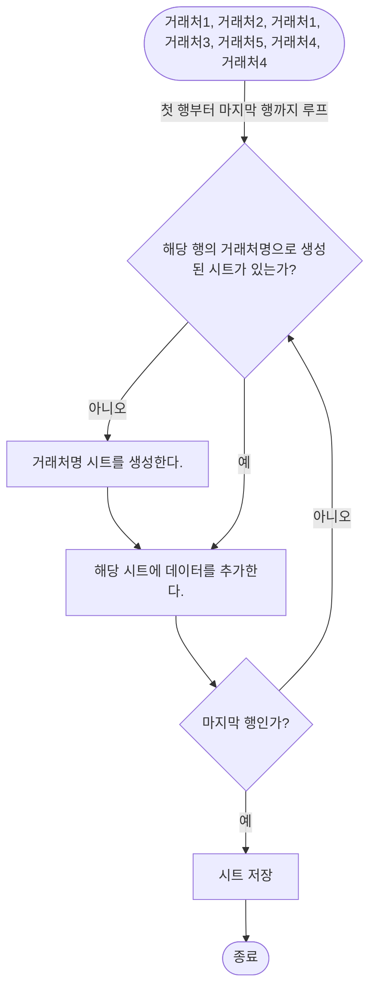

> 모든 거래처의 데이터가 들어있는 엑셀의 한 시트를 거래처별로 분리해서 각각의 시트를 엑셀 파일로 저장하는 자동화를 구현한다.

> 자동화란 인간지능이 아닌 기계의 힘(기술)을 최대한 활용하는 기술이라고 볼 수 있다. 최근 iOS의 [**자동화**](https://support.apple.com/ko-kr/guide/iphone/iph6d50ec543/ios) 에 재미있는 요소들이 있는 것 같아 관심있게 보는데, 이것 역시도 아이폰의 기술을 활용하여 스마트폰을 편리하게 사용할 수 있도록 하는 자동화의 하나이다. 뭐 이미 앱 이름도 **`자동화`**니까
{: .prompt-info }


## **AI의 시대다**
---

바야흐로 **AI**의 시대다. 

- 쉽게 접할 수 있는 검색 알고리즘

- 대 이커머스 시대라 할 수 있는 상품 추천 서비스

- 로켓 배송 등으로 대표되는 물류 자동화 기술

- 키워드 몇개로 그림도 그려지는 시대

점점 AI를 빼놓고는 상상할 수 없는 시대가 되어감을 느낀다.

감사하게도[^friend] 좋은 기회로 `자동화`를 구현할 기회가 있었다.


## **무엇을 자동화할 것인가?**
---

여기서 해결하려는 문제는 아래와 같다.
- 한 달 단위의 거래처 데이터가 엑셀의 한 시트에 모두 저장되어 있다.
- 이 엑셀 시트를 거래처별로 분리해서 `거래처.xlsx` 파일로 저장해야 한다.
- 1개의 엑셀 시트가 들어있는 1개의 엑셀 파일이 1개의 시트가 들어있는 n개의 엑셀 파일로 나뉘는 문제이다.


## **문제 해결 알고리즘**
---
단순하게 생각했다.

- 전체 거래처가 기록된 시트의 첫행부터 마지막행까지 루프를 돈다.
    - 거래처명으로 생성된 시트가 없다면, 새로 생성해서 데이터를 추가한다.
    - 거래처명으로 생성된 시트가 있다면, 해당 시트에 데이터를 추가한다.
- 각각의 시트를 `거래처.xlsx` 파일로 저장한다.





## **소스코드**
---

> **vba** 는 처음이다.
{: .prompt-info }

초기 버전 의 주요 소스코드는 아래와 같다. 

```vb
Sub Extractor() '메인 매크로
    baseSheetRowCount = Range("a1", Range("a1").End(xlDown)).Rows.Count '메인 시트의 전체 행수
    dataColStart = "E"   '메인 시트에서 복사할 컬럼의 시작
    dataColEnd = "Z"    '메인 시트에서 복사할 컬럼의 마지막
    venderCol = 1 '거래처 이름이 있는 열이며 1이면 첫번째 의미
    '...
    '메인 시트의 전체 행 루프
    For i = 2 To baseSheetRowCount
        '...
        vender = Cells(i, venderCol).Value 'i 행의 1번째 열에서 매입처명 가져오기
        '...

        '신규 시트 만들기, 타이틀 행인 첫번째줄 복사
        If Not hasSheet Then
            '현재 생성되어 있는 시트 마지막에 새로운 시트 추가
            Worksheets.Add after:=Worksheets(wsCount)
            '생성된 시트의 이름을 거래처명으로 바꾸기
            Worksheets(wsCount + 1).Name = vender
            '생성된 시트에 제목행인 첫번째 행 복사
            Worksheets(1).Range(dataColStart & "1:" & dataColEnd & "1").Copy Destination:=Worksheets(vender).Range("A1")
        End If

        '복사할 대상 시트의 마지막 행 다음에 데이터를 복사해야 함
        venderSheetLastRow = Worksheets(vender).Cells(Rows.Count, venderCol).End(xlUp).Row
        '선택된 시트에 복사할 원본 시트의 행
        Worksheets(1).Range(dataColStart & i & ":" & dataColEnd & i).Copy

        '타겟 시트의 A1 column 부터 서식 포함해서 붙여넣기
        With Worksheets(vender).Range("A" & venderSheetLastRow + 1)
            .PasteSpecial xlPasteAllMergingConditionalFormats
            .PasteSpecial xlPasteColumnWidths
            .PasteSpecial xlPasteFormats
            .PasteSpecial xlPasteFormulasAndNumberFormats
            .PasteSpecial xlPasteValuesAndNumberFormats
            .PasteSpecial xlPasteAll
        End With
    Next i

    '최종 시트 저장
    saveSheets
End Sub

Function saveSheets()
    '데이터 원본인 1번째 시트 제외, 나머지 시트 전부 저장
    For i = 2 To Sheets.Count
        ActiveWorkbook.Sheets(i).Select
        ActiveSheet.Copy

        'ThisWorkbook = 매크로를 실행시키는 파일
        'ActiveWorkbook = 현재 활성화된 엑셀 파일
        ActiveWorkbook.SaveAs ThisWorkbook.Path & "\" & Format(Date, "yymmdd") & "_" & ActiveSheet.Name & ".xlsx"
        ActiveWorkbook.Close
    Next
End Function
```

## **결과**
---

동작은 했다.

단지, 동작만 했을 뿐이다.

> 다음 글 : [[vba] 매크로를 활용한 엑셀 자동화 거래처별 엑셀 시트 나누기(2)](/posts/vba-매크로를-활용한-엑셀-자동화-거래처별-엑셀-시트-나누기(2))
{: .prompt-info }

[^friend]: `친구야 일 하나 같이 하자.`