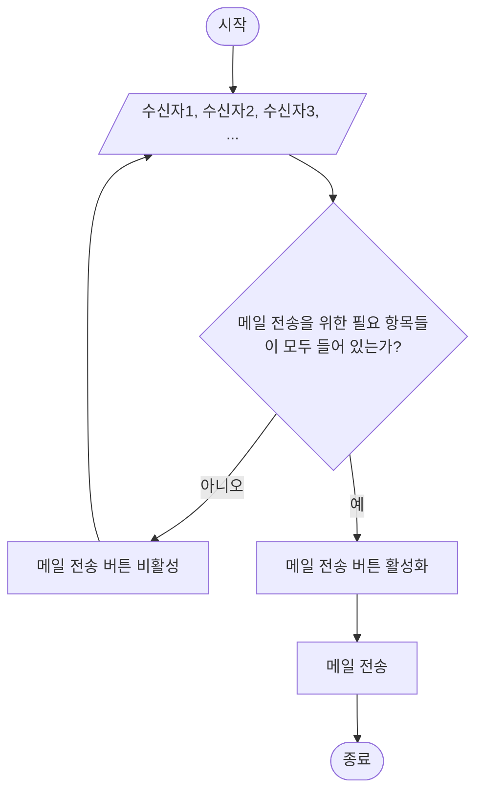

> 같은 내용의 메일을 매달 여러 거래처에 동시에 보낸다.

> 연관된 글 
>- [[vba] 매크로를 활용한 엑셀 자동화 거래처별 엑셀 시트 나누기(1)](/posts/vba-매크로를-활용한-엑셀-자동화-거래처별-엑셀-시트-나누기(1))
>- [[vba] 매크로를 활용한 엑셀 자동화 거래처별 엑셀 시트 나누기(2)](/posts/vba-매크로를-활용한-엑셀-자동화-거래처별-엑셀-시트-나누기(2))
{: .prompt-info }

## **해결해야 하는 문제점**
---

- [ ] 같은 내용의 메일을 여러명에게 주기적으로 보내야 하는 상황이다.
- [ ] 각 수신자별 첨부파일을 다르게 보내야 한다.
- [ ] 무료 메일 서비스를 봐도, 같은 메일을 한 사람씩 나눠주는 기능은 있는 것 같지만, 첨부파일까지 다르게 보내는건 찾기 어렵다.


## **구현 시나리오**
---

버튼 한 번만 누르면, 알아서 수신자별 첨부파일까지 포함한 메일이 각 수신자에게 전송하도록 한다.

1. DB 에서 수신자 목록을 불러온다. 
- 수신자 목록 기반 메일 제목, 첨부 파일명을 관리한다.
2. 메일 전송 관련 필수 조건들이 충족되었다면, 메일을 전송한다.



## **무엇으로 구현할 것인가?**
---
`windows` 기반으로 동작하는 앱이 필요하다.

그렇다면, exe 파일을 만들어야 할 것 같고, 관련 프레임워크를 검색해 봤다.

- `electron` (이건 너무 무겁고)
- `tauri` (웬지 간지나는 Rust...)
- `NW.js`
- `CEF`
- `flutter`

이 외에 
`golang`, `python` 으로 만들까 싶기도 했으나,

그냥 `c#` 으로 만들기로 했다.

> 해본 적 없지만 가장 간지날 것 같으니까
{: .prompt-info}


## **어떻게 해결할 것인가?**
---

`c#`에 `window form`이라는 것이 있더라.

왠지 이미 다 만든 것 같다.
{: width="972" height="589" .left}


> c# 개발을 위한 windows 기반 환경을 구성하는 방법은 따로 설명하지 않는다.
{: .prompt-tip }
> macOS 기반 visual studio 에서는 window form 기능을 사용할 수 없다.
{: .prompt-warning }


## **소스코드**
---

엑셀을 수신자 목록을 관리하기 위한 DB 로 활용하기로 했다.

c#에서 Excel 을 컨트롤할 수 있는 라이브러리를 설치한다.
- Nuget : `Microsoft.Office.Interop.Excel`
기존에 네이버 메일을 사용하고 있었으므로 업무 연장선에서 그대로 사용하기로 한다.
- smtp/imap : [`naver mail`](https://help.naver.com/service/5632/contents/18534?osType=PC&lang=ko){: target='_blank'}

> 윈도우 자체 메일 서버 기능도 있었다.
{: .prompt-info }

```c#

using Excel= Microsoft.Office.Interop.Excel;


namespace mailer
{
    public partial class Form1 : Form
    {
        public Form1()
        {
            InitializeComponent();
        }
        
        //전송하기 클릭
        private void button2_Click(object sender, EventArgs e)
        {
            try
            {
                MailMessage mail = new MailMessage();
                
                //...
                
                SmtpClient client = new SmtpClient(smtp);

                //...
                    
                foreach (ListViewItem item in listView1.Items)
                {
                    mail.To.Clear();
                    mail.Subject = item.SubItems[1].Text;
                    mail.To.Add(item.SubItems[2].Text);
                    mail.Body = textBox1.Text;

                    //참조 수신자
                    if (item.SubItems[3].Text.Trim(' ') != "") {
                        mail.Bcc.Add(item.SubItems[3].Text);
                    }
                    
                    string attachmentPath = Path.Combine(Environment.CurrentDirectory, item.SubItems[4].Text);
                    Attachment attachment = new Attachment(attachmentPath);
                    mail.Attachments.Clear();
                    mail.Attachments.Add(attachment);

                    //...

                    client.Send(mail);
                }
                //메일 보낸 결과에 대해 알 수 있는 방법은 없는 것 같다.
                MessageBox.Show("전송했습니다.");
            }
            catch(Exception ex) {
                MessageBox.Show(ex.ToString());
            }
        }
        //목록 불러오기
        private void button1_Click(object sender, EventArgs e)
        {
            clearList();
            progressBar1.PerformStep();

            Excel.Application excel = new Excel.Application();
            excel.DisplayAlerts = false;
            
            //excel db
            string path = Path.Combine(Environment.CurrentDirectory, "clientList.xlsx");

            Excel.Workbook workbook = excel.Workbooks.Open(path);
            progressBar1.PerformStep();
            Excel.Worksheet worksheet = workbook.Worksheets[1];
            progressBar1.PerformStep();
            
            //...


            //2차원 배열 선언
            //처음 봤다. 경험을 더 쌓아야 한다.
            object[,] data = range.Value;
            
            workbook.Close();
            excel.Quit();

            progressBar1.PerformStep();
            ReleaseExcelObject(worksheet);
            ReleaseExcelObject(workbook);
            ReleaseExcelObject(excel);
            progressBar1.PerformStep();
            
            AddDataToList(data);
        }

        private void clearList() {
            progressBar1.Value = 0;
            listView1.Items.Clear();
        }

        private void AddDataToList(object[,] obj) {
            listView1.BeginUpdate();
            listView1.Items.Clear();
            button2.Enabled = true;

            //...
            
            listView1.EndUpdate();
            this.Refresh();
        }
        //from web
        private void ReleaseExcelObject(object obj)
        {
            try {
                if (obj != null) {
                    //객체 메모리 해제
                    Marshal.ReleaseComObject(obj);
                    obj = null;
                }
            }
            catch (Exception ex) {
                obj = null;
                throw ex;
            }
            finally { 
                GC.Collect(); 
            }
        }

        private void Form1_Load(object sender, EventArgs e)
        {
            listView1.View = View.Details;
            listView1.FullRowSelect = true;
            listView1.Columns.Add("거래처 명", 80);
            listView1.Columns.Add("제목", 170);
            listView1.Columns.Add("수신 이메일", 200);
            listView1.Columns.Add("참조", 200);
            listView1.Columns.Add("첨부파일명", 170);

            progressBar1.Style = ProgressBarStyle.Continuous;
            progressBar1.Minimum = 0;
            progressBar1.Maximum = 90;
            progressBar1.Step = 15;
            progressBar1.Value = 0;
        }
    }
}
```

## **결과**
---


지난 번 엑셀 vba 매크로에서 최종 생성되는 `거래처.xlsx` 파일을 첨부파일로 담아서 메일을 보내는 프로그램이다.

기대보다 꽤 잘 동작한다고 한다.

현재, prototype 개념으로 몇가지 테스트 해보면서 개선하는 중이다.

잘 선택한 것 같다.

`c#` 재밌다.
